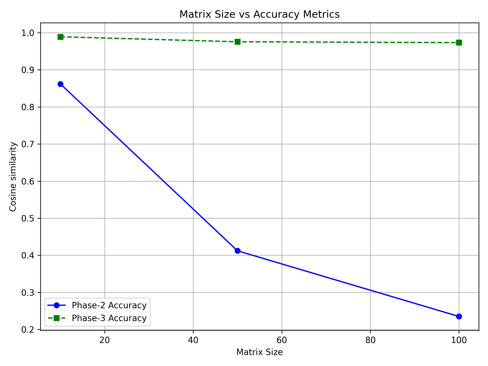
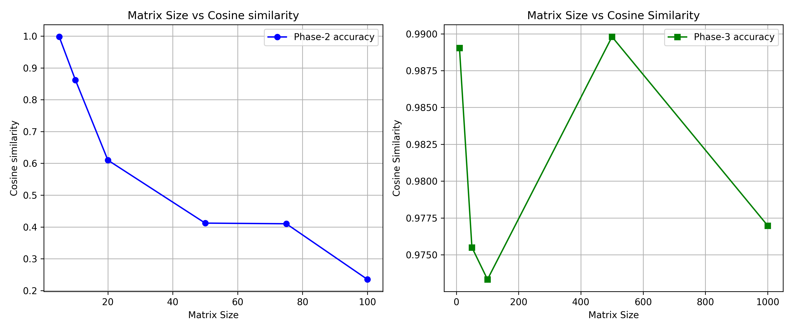

# Hybrid Reinforcement Learning Approach for Computing Numerical Eigenvectors

## Table of Contents

- [Overview](#overview)
- [Statistics](#statistics)
  - [Comparision with mid-eval Model](#comparision-with-mid-eval-model)
  - [Comparison with Standard Shift and Invert](#comparison-with-standard-shift-and-invert)
  - [Comparison with Pure RL](#comparison-with-pure-rl)
- [Strengths](#strengths)
- [Component Deep Dive](#component-deep-dive)
  - [1. Core Numerical Engine (`ShiftInvertPowerRL` Class)](#1-core-numerical-engine-shiftinvertpowerrl-class)
    - [Critical Methods:](#critical-methods)
  - [2. RL Environment (`ShiftInvertEnv` Class)](#2-rl-environment-shiftinvertenv-class)
    - [Reward Engineering:](#reward-engineering)
  - [3. RL Training Pipeline (`train_hybrid_eigen_solver`)](#3-rl-training-pipeline-trainhybrideigensolver)
    - [Phase 1: Ground Truth Computation](#phase-1-ground-truth-computation)
    - [Phase 2: PPO Configuration](#phase-2-ppo-configuration)
    - [Phase 3: Hybrid Training](#phase-3-hybrid-training)
    - [Phase 4: Evaluation Metrics](#phase-4-evaluation-metrics)
- [RL Algorithm Classification](#rl-algorithm-classification)
- [Performance Considerations - Limitations](#performance-considerations---limitations)
- [Extension Opportunities](#extension-opportunities)


## Overview
This code implements a **hybrid numerical-RL approach** to compute eigenvectors of large matrices given it's eigenvalue. It combines:
1. **Shift-and-Invert Power Method**: Traditional iterative linear algebra for eigenvalue problems.
2. **Reinforcement Learning (RL)**: Policy-guided refinement of eigenvectors using the PPO algorithm.

**Key Innovation**: Uses RL to escape local minima and accelerate convergence where traditional methods might stagnate.

## Statistics


| **Matrix Size** | **Avg Cosine Distance** |
|-----------------|------------------------ 
| 10x10           | 0.01096875              |
| 50x50           | 0.02450000              |
| 100x100         | 0.02667100              |
| 500x500         | 0.01020200              |
| 1000x1000       | 0.02302125              |

*Table: Performance metrics across different matrix dimensions*  
*(The cosine similarities are 0.99985157, 0.99925956, 0.99912255, 0.9998716 , 0.99934624 respectively)*  
### Comparision with mid-eval Model
- The mid eval model was a pure RL aalgorithm with a very simple MLP. It would perform very poorly for matrices of sizes above 20

- The new model uses a 3 layered Neural Network (256x256x128) and uses Shift\&Invert strategy to warm start the search.
- Naturally it supports much larger sizes

* Average cosine similarity over a number of samples of each size [code here](Shift_Invert_Power_ed_RL_v1.ipynb)*

### Comparison with Standard Shift and Invert
- On a sparse 1000x1000 as seen in the file [Shift_Invert_Power_ed_RL_v1_INFERENCE_Along-with-comparision-with-Shift-n-Invert.ipynb](Shift_Invert_Power_ed_RL_v1_INFERENCE_Along-with-comparision-with-Shift-n-Invert.ipynb), there is a 50% improvement by using Hybrid Approach over Classical Shift and Invert.  
### Comparison with Pure RL
- As seen from the codes in the [pure-RL](pure-RL/) directory, using only RL is extremely hard to fine tune and train. Our result was essentially a stab in the dark. Using Hybrid approach guides the RL towards a more correct solution.

---
## Strengths
- **Adaptability**: Learns matrix-specific adjustment strategies. [This code shows training and inference for 1000x1000 sparse matrices](Shift_Invert_Power_ed_RL_v1_INFERENCE_Along-with-comparision-with-Shift-n-Invert.ipynb). 
- It Works well for [moderatly sized dense matrices as well](Shift_Invert_Power_ed_RL_v1_INFERENCE_Along-with-comparision-with-Shift-n-Invert.ipynb)
- **Hybrid Convergence**: RL reduces iterations needed after warm-start  

---

## Component Deep Dive

### 1. Core Numerical Engine (`ShiftInvertPowerRL` Class)
**Mathematical Foundation**: Solves eigenvalue problems using shifted systems:
```math
(A - σI)x = λx → (A - σI)^{-1}x = \frac{1}{λ}x
```
Where σ is a shift near the target eigenvalue.

#### Critical Methods:
| Method | Purpose | Technical Details |
|--------|---------|-------------------|
| `_precompute_shifted_matrix` | Factorizes `(A - σI)` | - Sparse: LU decomposition via `splu`<br>- Dense: Explicit matrix inverse |
| `solve_shifted_system` | Solves `(A - σI)x = b` | - Sparse: Uses precomputed LU factors<br>- Dense: Uses `np.linalg.solve` |
| `hybrid_power_iteration` | Warm-start eigenvector | Combines power iteration with shift-and-invert acceleration |

**Sparse Optimization**: Achieves O(n) complexity for sparse matrices via:
- Compressed Sparse Row (CSR) format
- SuperLU decomposition (`splu`)

---

### 2. RL Environment (`ShiftInvertEnv` Class)
**Observation Space** (`dim + 3`):
- **Primary State**: Current eigenvector estimate (`dim` elements)
- **Residual Context**: 
  - Mean of last 10 residuals
  - Minimum residual in window
  - Standard deviation of residuals

**Action Space** (`dim`-dimensional):
- Continuous adjustments ∈ [-1, 1] to eigenvector components
- Scaled by 0.1 before application:  
  `adjusted_vec = state + 0.1 * action`

#### Reward Engineering:
```python
reward = -residual_norm - 0.1 * log(residual_norm + 1e-8)
```
- **Primary Term**: `-residual_norm` directly penalizes eigenvector error
- **Logarithmic Term**: Encourages faster convergence in early stages
- **Tolerance**: Episode terminates when `residual_norm < shift_tol` (1e-6)

---

### 3. RL Training Pipeline (`train_hybrid_eigen_solver`)
#### Phase 1: Ground Truth Computation
Uses ARPACK (`eigsh`) to find:
- Target eigenvalue (closest to σ)
- Reference eigenvector for validation

#### Phase 2: PPO Configuration
```python
model = PPO(
    "MlpPolicy",
    env,
    learning_rate=1e-4,
    gamma=0.99,
    policy_kwargs=dict(net_arch=[256, 256, 128])
)
```
- **Network Architecture**: 3-layer MLP (256 → 256 → 128 neurons)
- **Discount Factor**: γ=0.99 prioritizes long-term convergence
- **Learning Rate**: 1e-4 balances stability and speed

#### Phase 3: Hybrid Training
1. RL agent interacts with environment for 50,000 timesteps
2. Combines policy updates with power iteration stabilization

#### Phase 4: Evaluation Metrics
- **Residual Norm**: $||Av - λv||$
- **Cosine Distance**:  
  ```math
  \text{cos\_dist} = \frac{2}{\pi} \arccos(|\text{cos\_sim}|)
  ```
  Measures angular deviation from true eigenvector (0=perfect alignment, 1=orthogonal).

---

## RL Algorithm Classification
**PPO (Proximal Policy Optimization)** is used here:
```
RL Algorithms
└── Model-Free RL
    └── Policy Optimization
        └── PPO
```

**Why PPO?**
- Handles continuous action spaces (required for vector adjustments)
- Avoids destructive policy updates via clipped objective
- Sample-efficient for medium-dimensional problems (≈1,000D actions here)


---

## Performance Considerations - Limitations

- **Training Cost**: ~50k timesteps required per matrix
- **Eigenvalue Clustering**: Struggles when σ is near multiple eigenvalues
- **Symmetric Assumption**: Requires $A = A^\intercal$

## Extension Opportunities
1. **Joint Learning - Eigenvalues \& Eigenvectors**: Modify the model to jointly learn both the eigenvalue and eigenvector of given matrix by using Rayleigh quotient to compute $λ$ from the current eigenvector estimate and penalize residual norms derived from current $λ$ estimate. 
2. **Adaptive σ**: Let RL agent adjust shift during training
3. **Alternative RL Algorithms**: Test SAC/TD3 for comparison with PPO. Use GPU-optimised training strategies
4. **Extend to non-Symmetric Matrices - Handling Complex Values**: Adapt the framework and environment to handle non-symmetric matrices where eigenvalues and eigenvectors may be complex.
5. **Further testing of Adaptability**: Apply this approach on Graph Matrices and observe how the model learns

This hybrid paradigm demonstrates how traditional numerics and modern RL can synergize for challenging linear algebra problems.

